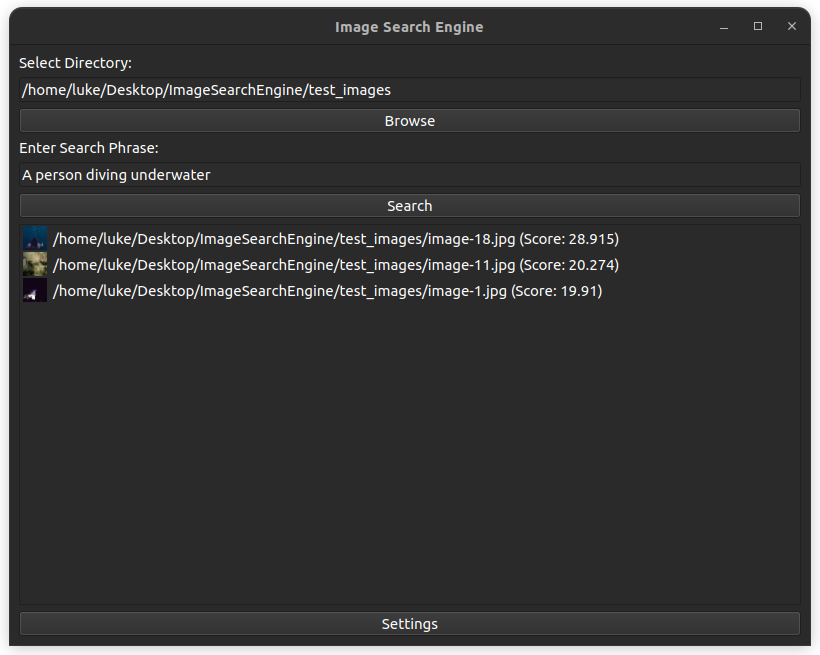

# Image Search Engine

## Overview

The Image Search Engine is a desktop application that allows users to search for images within a selected directory based on a given search phrase. It uses OpenAI's CLIP model for semantic search and PyQt6 for the graphical user interface.



## Features

- Select a directory containing images.
- Enter a search phrase to find relevant images.
- Displays the top N matching images with thumbnails.
- Adjustable number of search results via settings.
- Supports various image formats: PNG, JPG, JPEG, GIF, BMP.

## Installation

### Prerequisites

- Python 3.8+
- `pip` (Python package installer)

### Dependencies

Install the required Python packages using `pip`:

```bash
pip install -r requirements.txt
```

## Usage
1. **Selecting Directory:** Click on the "Browse" button to select a directory containing images.
2. **Entering Search Phrase:** Enter a search phrase in the provided input box.
3. **Searching:** Click on the "Search" button to find the top matching images.
4. **Adjusting Settings:** Click on the "Settings" button to adjust the number of results displayed.